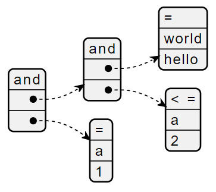

# Redis Module - Redis Rule Module

A custom Redis Module written in Rust language to support simple management of JSON Rules,
along with securing and execution of confidential rules.

## Warning

This code is not ready for Production.

## TODO

- Create unit tests.
- Externalise the get_dek() method as a module to fetch the Data Encryption Key from a trusted external source.
- Load test this module to measure its performance on different hardware.

## Redis Commands

The following Redis commands are added with this module.

- **REDISRULE.GET**
  
  Fetch the JSON Rule from Redis Rules. This command will return the encrypted JSON Rule of Confidentail Rules.

  **Usage**
  
  `REDISRULE.GET <RULE_INDEX>`
  
  **Return**
  - Redis Rule as JSON.
  - Error if RULE_INDEX does not exist.

- **REDISRULE.GETCONFI**

  Fetch the JSON Rule from Redis Rules. This command will return the decrypted JSON Rule of Confidential Rules, and return the plain text JSON Rule of Non-Confidential Rules.

  **Usage**

  `REDISRULE.GETCONFI <RULE_INDEX>`

  **Return**
  - Redis Rule as a decrypted JSON if this is a Confidential Rule.
  - Redis Rule as a plain-text JSON if this is a Non-Confidential Rule.
  - Error if RULE_INDEX does not exist.

- **REDISRULE.LOCK**
  
  Lock the specified Redis Rule from being updated or deleted. Note that this command is idempotent. `f(f(x)) = y`.

  **Usage**

  `REDISRULE.LOCK <RULE_INDEX>`

  **Return**
  - `OK` if command is successful.
  - Error if RULE_INDEX does not exist.

- **REDISRULE.UNLOCK**
  
  Unock the specified Redis Rule for updating or deletion. Note that this command is idempotent. `f(f(x)) = y`.

  **Usage**

  `REDISRULE.UNLOCK <RULE_INDEX>`

  **Return**
  - `OK` if command is successful.
  - Error if RULE_INDEX does not exist.

- **REDISRULE.DEL**
  
  Delete the specified Redis Rule from storage.

  **Usage**

  `REDISRULE.DEL <RULE_INDEX>`

  **Return**
  - `OK` if command is successful.
  - Error if RULE_INDEX does not exist.

- **REDISRULE.PUT**
  
  Add a new Redis Rule, or update an existing Redis Rule that is not locked.

  **Usage**

  `REDISRULE.PUT <RULE_INDEX> <JSON_RULE> <LOCK_FLAG> [CONFIDENTIAL_FLAG]`
  
  Refer to [Examples](#examples).

  |Parameter|Description|Optional|
  |---|---|---|
  |`RULE_INDEX`|Redis Rule ID in i32 specified by you.|No|
  |`JSON_RULE`|Minified JSON Rule with literals specified in escapted double quotes `\"`.|No|
  |`LOCK_FLAG`|`TRUE` if this rule needs to be Locked. `FALSE` if otherwise.|No|
  |`CONFIDENTIAL_FLAG`|`FALSE` if not specified. Specify as `TRUE` if the JSON Rule needs to be encrypted-at-rest.|Yes|

  **Note**
  
  This module uses AES-GCM with 256 bits Data Encryption Key. A random 96 bits nonce is used for each Redis Rule.

  **Return**
  - `OK` if command is successful.
  - Error if RULE_INDEX refers to an existing Redis Rule that is locked from updates.

- **REDISRULE.EVAL**
  
  Evaluate the provided JSON string using the specified Redis Rule. If this is a Confidential Rule, the rule will be decrypted in memory to evaluate the JSON string. The in-memory Redis Rule is transient.

  **Usage**

  `REDISRULE.EVAL <RULE_INDEX> <JSON_INPUT>`
  
  Refer to [Examples](#examples).

  |Parameter|Description|Optional|
  |---|---|---|
  |`RULE_INDEX`|Redis Rule ID in i32 specified by you.|No|
  |`JSON_INPUT`|Minified JSON string with literals specified in escapted double quotes `\"`.|No|

  **Return**
  - `1` if the JSON input and Redis Rule evaluates to ***True***.
  - `0` if the JSON input and Redis Rule evaluates to ***False***.
  - Error if RULE_INDEX does not exist.
  - Error if there is a parsing error of the Redis Rule.
  - Error if there is a parsing error of the JSON input.

## Building this Module

```shell
cargo build --release
```

## Running this Module

```shell
redis-server --loadmodule <Path to libredisrule.so>
```

## Examples

### 1. **PUT** Redis Rule - Non-Confidential Rule

This example will create a sample non-confidential Redis Rule with index 1 and unlocked. Note how each String literal in the JSON rule needs to be surrounded in escaped double quotes `\"`. The underlying JSON will not be encrypted-at-rest, and editable.

```shell
REDISRULE.PUT 1 "[\"and\",[\"and\",[\"=\",\"world\",\"hello\"],[\"<=\",\"a\",2]],[\"=\",\"a\",1]]" false
> OK
```

- The JSON Rule & PlantUML representation

  ```JSON
  [
    "and",
    [
      "and",
      [
        "=",
        "world",
        "hello"
      ],
      [
        "<=",
        "a",
        2
      ]
    ],
    [
      "=",
      "a",
      1
    ]
  ]
  ```

  

### 2. **PUT** Redis Rule - Confidential Rule

This example will create a sample Confidential Redis Rule with Index 2, and locked to prevent updates or deletes. Note how each String literal in the JSON needs to be surrounded in escaped double quotes `\"`. The underlying JSON will be encrypted. The same JSON rule from the first example is reused.

```shell
REDISRULE.PUT 2 "[\"and\",[\"and\",[\"=\",\"world\",\"hello\"],[\"<=\",\"a\",2]],[\"=\",\"a\",1]]" true true
> OK
```

### 3. **GET** Redis Rule

This example will fetch the JSON Rule by the Rule Index specified. No decryption will be applied on the JSON rule.

```shell
REDISRULE.GET 1
> "[\"and\",[\"and\",[\"=\",\"world\",\"hello\"],[\"<=\",\"a\",2]],[\"=\",\"a\",1]]"

REDISRULE.GET 2
> [Encrypted String]
```

### 4. **GETCONFI** Redis Rule

This example will fetch the JSON Rule by the Rule Index specified. Decryption will be applied on the JSON rule if the Confidential Flag is True.

```shell
REDISRULE.GETCONFI 1
> "[\"and\",[\"and\",[\"=\",\"world\",\"hello\"],[\"<=\",\"a\",2]],[\"=\",\"a\",1]]"

REDISRULE.GETCONFI 2
> "[\"and\",[\"and\",[\"=\",\"world\",\"hello\"],[\"<=\",\"a\",2]],[\"=\",\"a\",1]]"
```

### 5. **EVAL** Redis Rule

This example will supply a JSON input and a Rule Index, and receive a 1 or 0 evaluation result. 1 refers to a positive / true evaluation. 0 refers to a negative / false evaluation.

```shell
REDISRULE.EVAL 1 "{\"a\": 1, \"world\": \"hello\"}"
> (integer) 1

REDISRULE.EVAL 2 "{\"a\": 1, \"world\": \"hello\"}"
> (integer) 1

REDISRULE.EVAL 1 "{\"a\": 3, \"world\": \"hello\"}"
> (integer) 0

REDISRULE.EVAL 2 "{\"a\": 1, \"world\": \"me\"}"
> (integer) 0
```

## Recommended Redis ACL

If you are running Redis 6 or later, please make use of Redis ACL to segregate the areas of responsibilities, and avoid unintended loss of rules, or exposure of confidential rules.

- **Applciation Role** - Role assigned for use by application runtime. Primary concerned with using the rules, and optionally displaying the plain-text rules.
- **DevOps Role** - Role used by automation to deploy and manage the rules based on pipeline. Primary concern is to update or delete the rules via automation.
- **Break Glass Role** - Role used during an emergency to analyze the deployed rules. Primary concern is to perform root cause analysis.

|Command|Application Role|DevOps Role|Break Glass Role|
|---|:-:|:-:|:-:|
|`REDISRULE.GET`|x||x|
|`REDISRULE.GETCONFI`|||x|
|`REDISRULE.LOCK`||x||
|`REDISRULE.UNLOCK`||x||
|`REDISRULE.DEL`||x||
|`REDISRULE.PUT`||x||
|`REDISRULE.EVAL`|x|||
